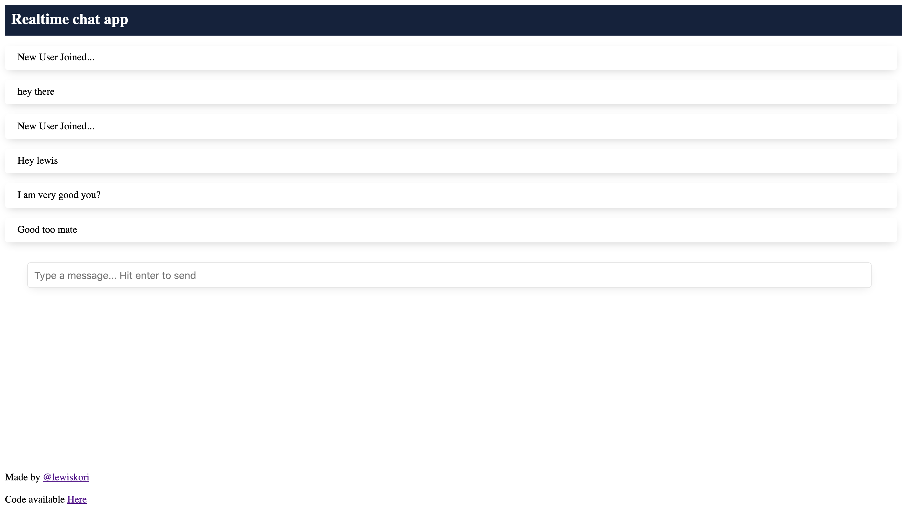

# vue chat app

the project is a websocket implementaion of with golang. a chat app has been implemented for the demo.
thanks to [Elliot Forbes](https://tutorialedge.net/golang/go-websocket-tutorial/) for his amazing
lesson with react as a frontend.

Frontend code is available [here](https://github.com/lewis-kori/go-vue-chat)

## [Demo](https://go-chat.netlify.app/)

